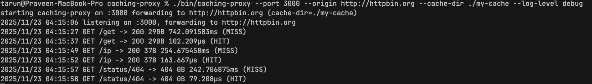

<h1>
  
  Caching Proxy
</h1>

A high-performance CLI tool that acts as a caching [reverse proxy](https://www.cloudflare.com/en-in/learning/cdn/glossary/reverse-proxy/) server. It reduces repeated server hits by reusing cached disk responses.It will forward requests to the actual server and cache the responses on the disk. If the same request is made again, it will return the cached response instead of forwarding the request to the server.

## Table of Contents

- [Getting Started](#getting-started)
  - [Prerequisites](#prerequisites)
  - [Installation](#installation)
- [Usage](#usage)
  - [Command Line Options](#command-line-options)
  - [Examples](#examples)
- [Contributing](#contributing)

## Getting Started

### Prerequisites

- **Go**: You need to have Go installed (version 1.18 or later recommended). [Download Go](https://go.dev/dl/).
- **Make**: (Optional) For using the provided Makefile.

### Installation

1. **Clone the repository:**
   ```bash
   git clone https://github.com/kpraveenkumar19/caching-proxy
   cd caching-proxy
   ```

2. **Build the project:**
   Using Make:
   ```bash
   make build
   ```
   Or using Go directly:
   ```bash
   go build -o bin/caching-proxy ./cmd/caching-proxy
   ```

   This will create the executable binary in the `bin/` directory.

## Usage

Run the proxy server by specifying the port to listen on and the origin server to forward requests to.

### Command Line Options

The `caching-proxy` tool supports the following flags:

| Flag | Description | Default |
|------|-------------|---------|
| `--port` | **Required.** Port for the caching proxy to listen on. | `3000` |
| `--origin` | **Required.** Origin server base URL (e.g., `http://example.com`). | `""` |
| `--cache-dir` | Directory for on-disk cache storage. | OS user cache dir or `.cache/caching-proxy` |
| `--clear-cache`| Clear the cache directory and exit. | `false` |
| `--log-level` | Set logging level (`info` or `debug`). | `info` |
| `--version` | Print the version and exit. | `false` |

### Examples

**1. Start the proxy server:**

Forward requests from port `3000` to `http://dummyjson.com`:

```bash
./bin/caching-proxy --port 3000 --origin http://dummyjson.com
```
To Start with a custom cache directory and debug logging:

```bash
./bin/caching-proxy --port 3000 --origin http://dummyjson.com --cache-dir ./my-cache --log-level debug
```

**2. Make a request to the proxy:**

```bash
curl -v http://localhost:3000/products
```
*First request:* You should see `X-Cache: MISS`.
*Second request:* You should see `X-Cache: HIT`.

**3. Clear the cache:**

Clears the cache in the specified cache directory

```bash
./bin/caching-proxy --clear-cache --cache-dir ./my-cache
```
Clears the cache in the default OS user cache directory

```bash
./bin/caching-proxy --clear-cache 
```

example logs :

## Contributing

Contributions are welcome! If you'd like to contribute to this project, please follow these steps:

1.  Fork the repository.
2.  Create a new branch for your feature or bugfix
3.  Commit your changes and Push to the branch
4.  Open a Pull Request.
